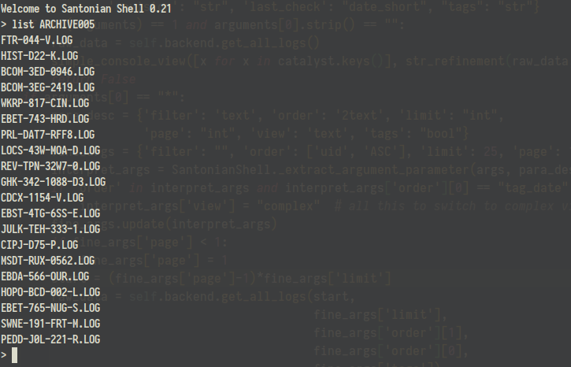
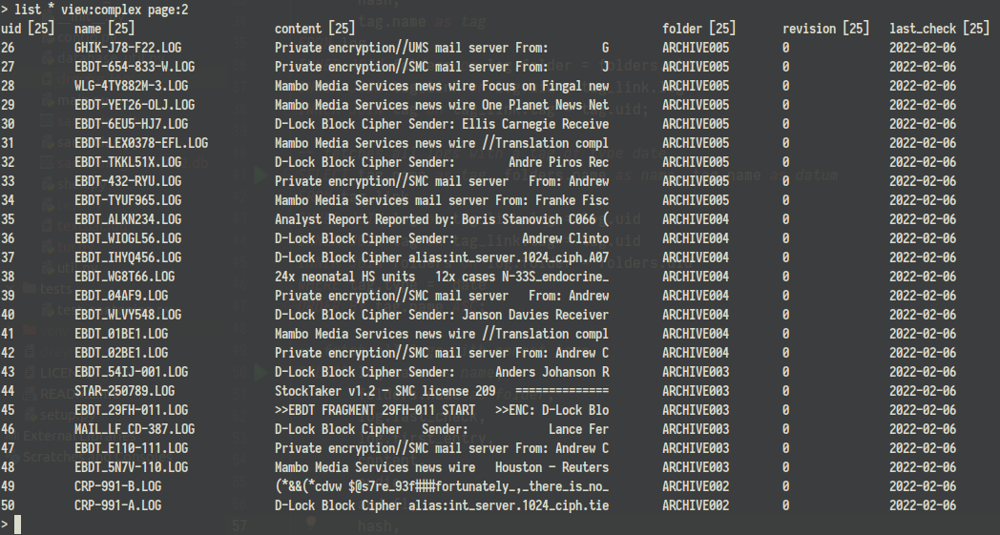
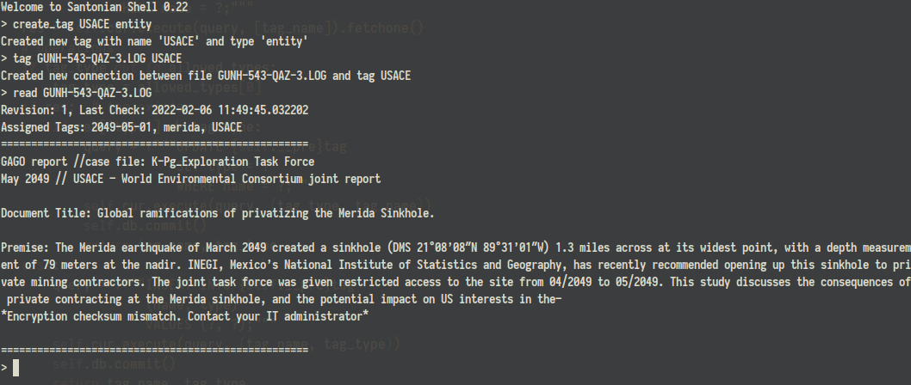
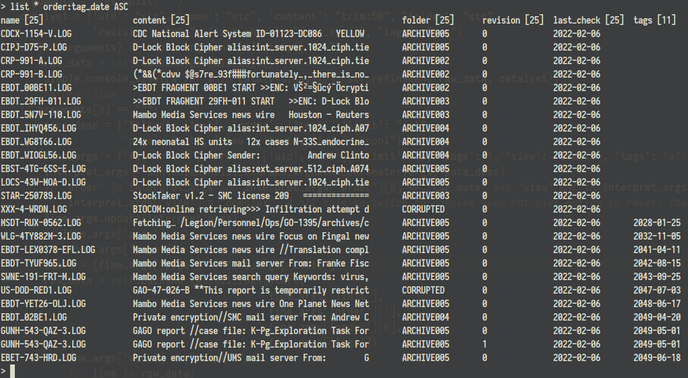
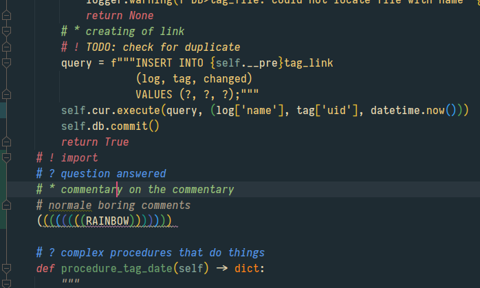

# Santonian Crawler

Fan Project regarding the game [GTFO](https://gtfothegame.com/)

This is, currently, a command line application that leverages the [Santonian Industries](https://santonianindustries.com/) API that was probably not meant to be an API. As of now the virtual console on the websites calls a backend that is directly accessible.

**DISCLAIMER: do not abuse the abilities of this program and stay local as much as possible**

In the beginning i just wanted an offline copy, also the website version had some hanging from time to time.

The first task was to crawl the entire database provided by the website and periodically check for changes, both in overall scope (read: new entries) but also for changes in the existing log files to divine some clues out of those changes. All data is saved in a local sqlite database

There is also a cli interface and a planned TUI.

## Some CMD features

Listing of logs in a local database to provide quick access without the internet

Complex listing of all logs with out without filters, order and pagination

Tagging of individual logs and automatically matching of dates via regex:

Sorting by individual columns and date tags:

## Installation

Assuming Linux for the time being as `readline`does not work in windows

1. Check out Repo `git clone https://github.com/BurnoutDV/SantonianCrawler.git`
2. Move inside directory `cd SantonianCrawler`
3. create virtual environment  `python3 -m venv ./venv`
4. activate virtual environment `source ./venv/bin/activate`
5. install package `python3 -m pip install .` (*use parameter `-e` if you intend to edit*)
6. start main with `python3 -m santonian_crawler.main`

## First Run

Upon start the program will look for a file called `santonian.db` in the current working directory, a sqlite file, if its not present a new one will be created, using the configured scheme. As of creation the database is completely empty (apart from a single meta-tag called *schema_version*).

To fill the database, the interactive shell has to be called (default main without arguments) and the procedure "full_fetch" to be executed, use `proc full_santonian_fetch`

## Missing Features

There is quite a lot i yet want to build

* cmd: Ability to trigger partial download by cmd
* cmd: Ability to trigger Tabula Rasa download by cmd
* cli arguments to allow cron job usage for recurring checks
* Text User Interface, maybe with [Textual](https://github.com/Textualize/textual)?
* cmd: filter by content
* cmd: proper datatable cmd interface, it messes up sometimes
* doc texts, expecially in the cmd side but also in the db backend
* properly integrating the santonian download codes in the rest

### Development Notes

This pile of spaghetti was being developed in PyCharm and i used some plugins to make it *better* for me, of note are two plugins:

* Rainbow Brackets
* Comments Highlighter

Those bring some color in the code and make the comments a bit more granular:

